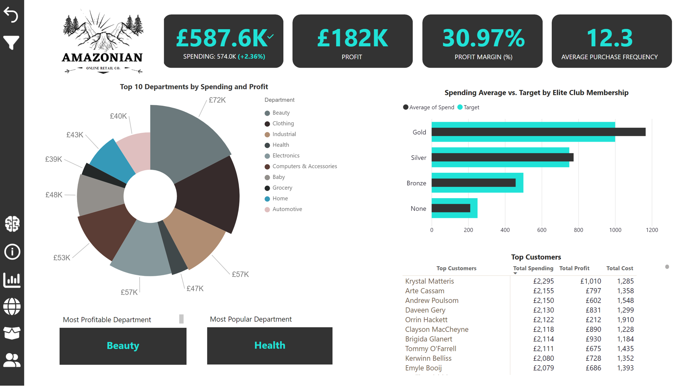
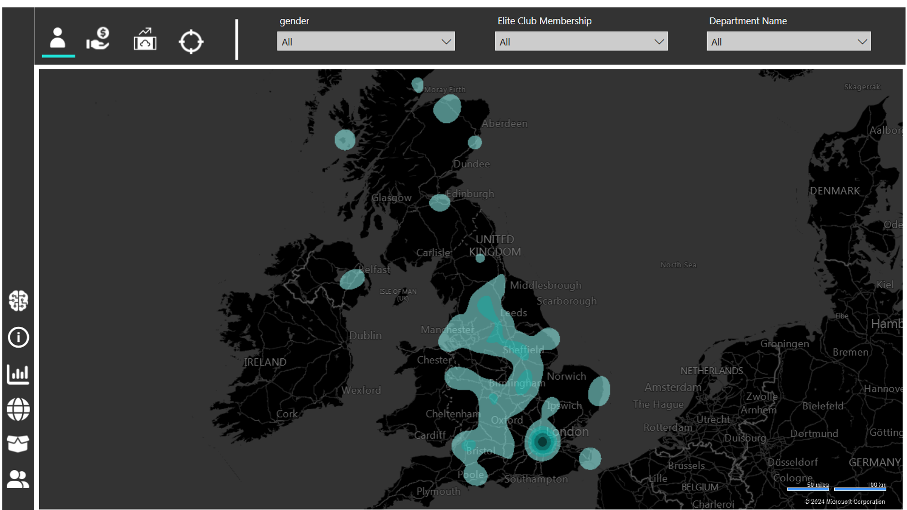
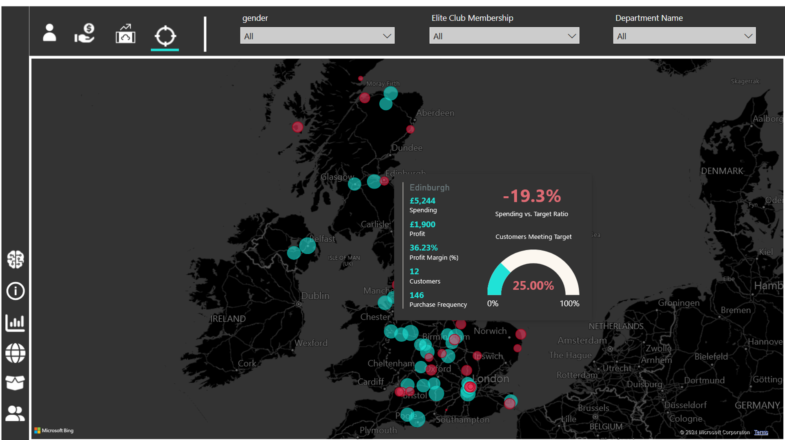
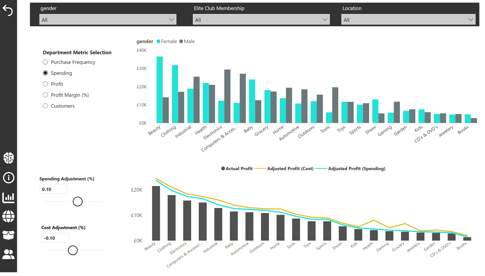
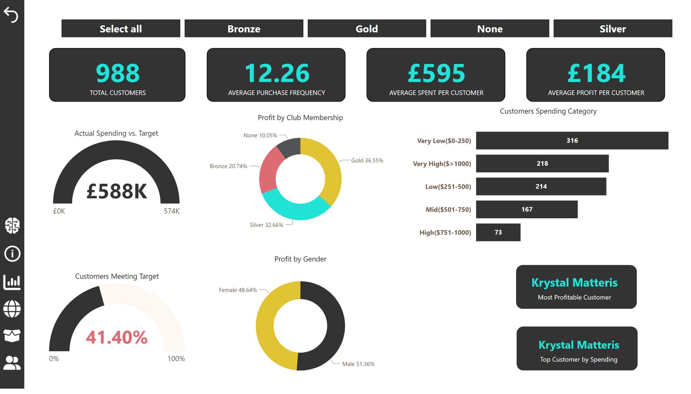

# Amazonian Dashboard

- **Description**:
  -  Implemented a Power BI dashboard using retailer customer data to uncover hidden patterns and trends.
  -  Conducted data cleaning and validation to ensure accuracy.
  -  Applied data modelling processes to establish relationships between data tables.
  -  Utilised DAX, measures, and calculated columns to enrich the data.
  -  Developed multi-level dashboards including Executive Dashboard, Departments Dashboard, Regional Dashboard, and Customers Dashboard.

- **Technologies Used**: List of technologies used (e.g., Python, SQL, Power BI).

  
  
  
  
  

